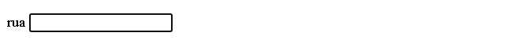

# Inputs
Também conhecido como entrada, é a forma que os usuários conseguem interagir dentro do formulário. Aqui, aprenderemos alguns tipos de inputs:
***
## Tipos de Inputs e Atributos
Seus tipos podem ser chamados pelo *atributo "type"(seus atributos serão falados ao deccorrer dos tipos), e eles são:*
1. text: Uma caixa de texto padrão: 
***
2. num: Uma caixa espécifica para números: 
### Atributos Para O Input Do Número
- max: Número máximo. Até qual número ele pode ir.
- min: Número mínimo. Valor mínimo para inserção.
***
3. email: Uma caixa de texto para emails: 
***
4. tel: Uma caixa de texto para telefones:
### Atributos Para O Input Do Número
- pattern: Define o padrão comum. No caso do telefone séria esse : ^\([1-9]{2}\) (?:[2-8]|9[0-9])[0-9]{3}\-[0-9]{4}$; [Explicação](https://pt.stackoverflow.com/questions/46672/como-fazer-uma-express%C3%A3o-regular-para-telefone-celular).
***
## Atributos Globais Para Os Inputs:  
- **name:Define o nome do input;**
- **id:Define uma identificação própria;**
- **type:Classifica o tipo do input;**
- **placeholder:Uma dica, do que o usuário deve inserir naquela caixa;**
